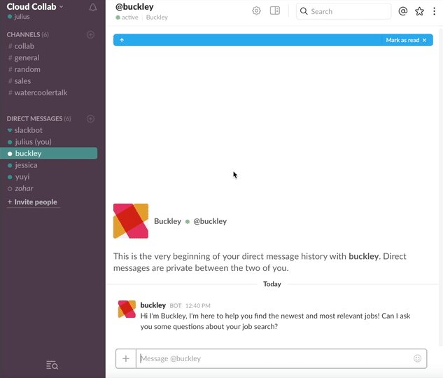

# BuckleyBot



## Installation steps

#### Project dependencies

```sh
# server side dependencies
npm install
```

#### Database setup

Install Postgres with Homebrew:
```sh
# update brew
brew update

# install postgres
brew install postgresql
```

## Running the Application

#### Local development

It may be helpful to have one terminal tab open per process

1. start the local postgres server:
  * `npm run dev:startdb`
2. run the build process to bundle server files and transpile code
  * `npm run dev:buildserver`
3. run the (node) server from the root directory of this project
  * `npm run dev:start`
4. run the build process to bundle client files and transpile code
  * `npm run dev:watchClient`

#### Local bot testing

It is required to have multiple tabs open 

0. start the local postgres server:
  * `npm run dev:startdb`
1. Drop current database (uncle) by starting another database:
  * `psql anotherdatabase`
  Within the database:
  * `drop database uncle`
2. Create a new database (uncle) and start:
  * `createdb uncle`
  * `psql uncle`
  * `\c uncle`
3. run the build process to bundle files and transpile code
  * `npm run dev:buildserver`
4. run the (node) server from the root directory of this project
  * `npm run dev:start`
5. Multiple saves might be required to generate all tables in database
  * command + s in sublime
6. Drop the current App in slack.com/apps under manage tab. Click Remove App
7. Add the app
8. Run node server/dist/utils/jobScraper.js to add jobs to database
9. Interact with the bot

